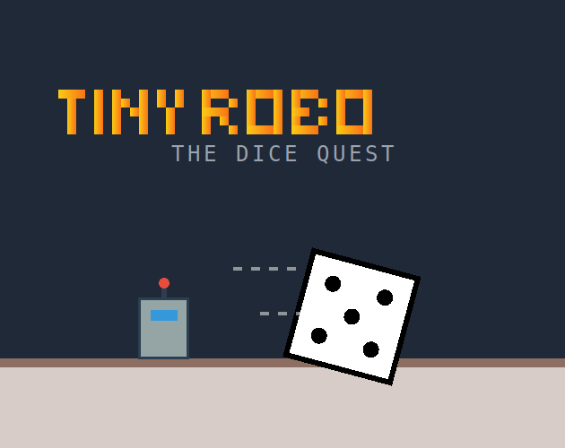

# Tiny Robo: The Dice Quest

**Tiny Robo: The Dice Quest** is a retro-futuristic 2D platformer where you play as a tiny robot navigating a giant, treacherous living room. Use your building abilities and unique power-ups to overcome furniture-sized obstacles, defeat spiders, and reach the finish line!

## 🎮 Gameplay

### Objective
Navigate through 3 handcrafted levels of increasing difficulty. Find the dice checkpoints to progress. Your goal is to survive the hazards of the giant world and find the exit.

### Controls
*   **W / A / S / D**: Move, Jump, and Duck.
*   **F**: Toggle **Build Mode**.
*   **SPACE**:
    *   *In Build Mode*: Place a block.
    *   *Normal Mode*: Use your Active Power-Up (Shoot Laser, Phase Dash).
*   **ESC**: Pause Game / Exit View Mode.

### The Dice Loadout System
At the start of every run, you must roll two dice to determine your loadout:
1.  **Block Type**: Determines the shape and behavior of the blocks you can build (Square, Wide, High, Floating, Temporary, or Random).
2.  **Power Up**: Grants a special ability (Double Jump, Laser Gun, Gravity Boots, Extra Life, or Phase Shift).

After completing a level, you get the chance to **Re-roll** one of your dice to adapt your strategy for the next challenge.

### Mechanics
*   **Build Mode**: Place blocks to create your own platforms, bridge gaps, or wall off enemies. You can even deconstruct your own blocks if you make a mistake.
*   **Physics**: Momentum-based movement with wall collisions and platforming.
*   **Hazards**: Avoid spikes, bottomless pits, and patrolling mechanical spiders.
*   **Intro Sequence**: Watch the dice roll across the level to reveal checkpoint locations before you start.

## 🛠️ Technologies Used

This game was built using modern web technologies without any external game engines:

*   **React 19**: Core framework for UI and state management.
*   **TypeScript**: For type-safe game logic and entity management.
*   **HTML5 Canvas**: High-performance 2D rendering for the game world, entities, particles, and lighting effects.
*   **Web Audio API**: All sound effects (jumping, shooting, dice rolling, music) are synthesized in real-time using oscillators and noise buffers. No external audio files are used.
*   **Tailwind CSS**: For styling the HUD, menus, and responsive layouts.
*   **Lucide React**: For UI icons.
*   **Local Storage**: Persists level progression and completion times.

## 🎨 Assets
All graphical assets (Cover, Thumbnail, Favicon) are generated SVGs, keeping the application lightweight and scalable.
